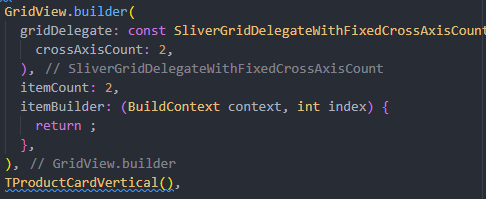

# 📱 E-Commerce Flutter App

A modern and feature-rich e-commerce mobile application built with Flutter, following clean architecture principles and utilizing Firebase services.


## 📋 Table of Contents

- [📱 E-Commerce Flutter App](#-e-commerce-flutter-app)
  - [📋 Table of Contents](#-table-of-contents)
  - [🔍 Overview](#-overview)
  - [✨ Features](#-features)
  - [🚀 Getting Started](#-getting-started)
    - [📋 Prerequisites](#-prerequisites)
    - [📦 Dependencies](#-dependencies)
    - [⚙️ Installation](#️-installation)
  - [🏗️ Project Structure](#️-project-structure)
  - [📘 Implementation Guide](#-implementation-guide)
    - [🔐 Authentication Module](#-authentication-module)
    - [🛍️ Product Catalog Module](#️-product-catalog-module)
  - [📝 Developer Notes](#-developer-notes)
    - [GetX State Management](#getx-state-management)
      - [Step1](#step1)
      - [Step2](#step2)
      - [Step3](#step3)
      - [Step4](#step4)
    - [Grid Layout Implementation](#grid-layout-implementation)
      - [Shortcut Command: `gridViewB`](#shortcut-command-gridviewb)
      - [Complete Syntax:](#complete-syntax)

## 🔍 Overview

This e-commerce application provides a seamless shopping experience with intuitive UI, smooth animations, and robust backend integration with Firebase services. The app follows the GetX pattern for state management and dependency injection.

## ✨ Features

- 🔐 **User Authentication** - Secure login, registration, and profile management
- 🏪 **Interactive Product Catalog** - Browse products by categories with search functionality
- 🛒 **Shopping Cart** - Add and manage products (coming soon)
- 💳 **Secure Payment Processing** - Multiple payment options
- 📦 **Order Tracking** - Real-time updates on order status (coming soon)
- 💖 **Wishlist** - Save favorite products for later
- 🌙 **Theme Support** - Toggle between dark and light modes
- 🌐 **Multi-language Support** - Internationalization ready (coming soon)
- 📱 **Responsive Design** - Optimized for all device sizes

## 🚀 Getting Started

### 📋 Prerequisites

- Flutter SDK 3.19.0 or higher
- Dart 3.3.0 or higher
- Android Studio / VS Code
- Firebase account
- Git

### 📦 Dependencies

```yaml
dependencies:
  flutter:
    sdk: flutter

  # Utility Packages
  http: ^1.2.1
  intl: ^0.19.0
  logger: ^2.2.0
  url_launcher: ^6.2.6
  flutter_native_splash: ^2.4.0
  smooth_page_indicator: ^1.1.0
  connectivity_plus: ^6.0.3
  lottie: ^3.1.0

  # Icons
  iconsax: ^0.0.8
  cupertino_icons: ^1.0.6

  # State Management
  get: ^4.6.6
  get_storage: ^2.1.1

  # Product Specific
  readmore: ^3.0.0
  carousel_slider: ^5.0.0
  flutter_rating_bar: ^4.0.1
  capped_progress_indicator: ^0.0.2

  # Firebase
  firebase_core: ^2.30.1
  firebase_auth: ^4.19.4
  cloud_firestore: ^4.17.2
```

### ⚙️ Installation

1. **Clone the repository**:
   ```bash
   git clone https://github.com/yourusername/ecommerce-flutter.git
   cd ecommerce-flutter
   ```

2. **Install dependencies**:
   ```bash
   flutter pub get
   ```

3. **Configure Firebase**:
   ```bash
   flutter pub add firebase_core
   flutterfire configure
   ```

4. **Run the app**:
   ```bash
   flutter run
   ```

## 🏗️ Project Structure

```
lib/
├── common/
│   ├── styles/         # App-wide styling definitions
│   └── widgets/        # Reusable widgets
├── data/
│   ├── repositories/   # Data repositories
│   └── services/       # API and backend services
├── features/
│   ├── authentication/ # Authentication screens and logic
│   ├── personalization/# User personalization features
│   └── shop/           # Shop related screens and logic
├── localization/       # Language translations
├── utils/             
│   ├── constants/      # App-wide constants
│   ├── device/         # Device utilities
│   ├── exceptions/     # Custom exceptions
│   ├── formatters/     # Data formatters
│   ├── helpers/        # Helper functions
│   ├── http/           # HTTP utilities
│   ├── loaders/        # Asset loaders
│   ├── local_storage/  # Local storage utilities
│   ├── logging/        # Logging utilities
│   ├── popups/         # Dialog and notification utilities
│   ├── theme/          # Theme utilities
│   └── validators/     # Input validators
├── app.dart            # App configuration
├── main.dart           # Entry point
└── navigation.dart     # Navigation structure
```

## 📘 Implementation Guide

### 🔐 Authentication Module

The authentication module handles user registration, login, and profile management using Firebase Authentication.

**Key Implementation Steps:**

1. **Create Firebase Authentication Service**:

```dart
class AuthenticationService {
  final FirebaseAuth _auth = FirebaseAuth.instance;
  
  Future<UserModel?> signInWithEmailAndPassword(String email, String password) async {
    try {
      final userCredential = await _auth.signInWithEmailAndPassword(
        email: email,
        password: password,
      );
      return userCredential.user != null ? UserModel.fromFirebase(userCredential.user!) : null;
    } catch (e) {
      Logger().e('Sign in error: $e');
      return null;
    }
  }
  
  // Additional authentication methods...
}
```

2. **Implement Authentication Controller with GetX**:

```dart
class AuthController extends GetxController {
  final AuthenticationService _authService = Get.find<AuthenticationService>();
  final Rx<UserModel?> user = Rx<UserModel?>(null);
  
  @override
  void onInit() {
    super.onInit();
    FirebaseAuth.instance.authStateChanges().listen((firebaseUser) {
      if (firebaseUser != null) {
        user.value = UserModel.fromFirebase(firebaseUser);
      } else {
        user.value = null;
      }
    });
  }
  
  Future<bool> login(String email, String password) async {
    try {
      final user = await _authService.signInWithEmailAndPassword(email, password);
      return user != null;
    } catch (e) {
      Get.snackbar('Error', 'Login failed: $e');
      return false;
    }
  }
  
  // Additional authentication methods...
}
```

### 🛍️ Product Catalog Module

The product catalog displays items from Firestore with filtering, sorting, and search capabilities.

**Key Implementation Steps:**

1. **Create Product Model**:

```dart
class Product {
  final String id;
  final String name;
  final String description;
  final double price;
  final List<String> images;
  final String category;
  final double rating;
  final int stock;
  
  Product({
    required this.id,
    required this.name,
    required this.description,
    required this.price,
    required this.images,
    required this.category,
    required this.rating,
    required this.stock,
  });
  
  factory Product.fromFirestore(DocumentSnapshot doc) {
    final data = doc.data() as Map<String, dynamic>;
    return Product(
      id: doc.id,
      name: data['name'] ?? '',
      description: data['description'] ?? '',
      price: (data['price'] ?? 0).toDouble(),
      images: List<String>.from(data['images'] ?? []),
      category: data['category'] ?? '',
      rating: (data['rating'] ?? 0).toDouble(),
      stock: data['stock'] ?? 0,
    );
  }
}
```

2. **Implement Product Repository**:

```dart
class ProductRepository {
  final FirebaseFirestore _firestore = FirebaseFirestore.instance;
  
  Future<List<Product>> getProducts({
    String? category,
    String? searchQuery,
    String? sortBy,
  }) async {
    Query query = _firestore.collection('products');
    
    if (category != null && category.isNotEmpty) {
      query = query.where('category', isEqualTo: category);
    }
    
    if (searchQuery != null && searchQuery.isNotEmpty) {
      // For proper search, consider using Algolia or other search services
      query = query.where('name', isGreaterThanOrEqualTo: searchQuery)
               .where('name', isLessThanOrEqualTo: searchQuery + '\uf8ff');
    }
    
    if (sortBy != null) {
      switch (sortBy) {
        case 'price_asc':
          query = query.orderBy('price', descending: false);
          break;
        case 'price_desc':
          query = query.orderBy('price', descending: true);
          break;
        // Add other sorting options
      }
    }
    
    final snapshot = await query.get();
    return snapshot.docs.map((doc) => Product.fromFirestore(doc)).toList();
  }
  
  Future<Product?> getProductById(String id) async {
    final doc = await _firestore.collection('products').doc(id).get();
    return doc.exists ? Product.fromFirestore(doc) : null;
  }
}
```

## 📝 Developer Notes

### GetX State Management

Getx can be used in `Navigation`, `state management`

#### Step1

add "Get" before MaterialApp, turning it into GetMaterialApp

```dart
void main() => runApp(GetMaterialApp(home: Home()));
```

#### Step2

Create my own controller file, ususally put it under controllers folder
Place all `variables, methods and controllers` inside it

```dart
import 'package:e_store/features/authentication/screens/login/login.dart';
import 'package:flutter/widgets.dart';
import 'package:get/get.dart';

class OnBoardingController extends GetxController {
  static OnBoardingController get instance => Get.find();

  //variables
  final pageController = PageController();
  Rx<int> currentPageIndex = 0.obs; // Rx stands for Reacts
  // makek it observable

  //Update Current Index when Page Scroll
  void updatePageIndicator(index) {
    currentPageIndex.value = index;
  }

  //Jump to the specific dot selected page.
  void dotNavigationClick(index) {
    currentPageIndex.value = index;
    pageController.jumpToPage(index);
  }

  //Update Current Index & Jump to the next page.
  void nextPage() {
    if (currentPageIndex.value == 2) {
      Get.offAll(() => const LoginScreen());
    } else {
      int page = currentPageIndex.value + 1;
      pageController.jumpToPage(page);
    }
  }

  //Update Current Index & jump to the last page.
  void skipPage() {
    currentPageIndex.value = 2;
    pageController.jumpToPage(2);
  }
}

```

#### Step3
Instantiate controller when you are going to use it in views
```dart
final controller = Get.put(OnBoardingController());
```

#### Step4
Now you are able to use all methods and variables in Controller by using controller.x
```dart
PageView(
            controller: controller.pageController,
            onPageChanged: controller.updatePageIndicator,
            children: const [
              OnBoardingPage(
                image: TImages.onBoardingImage1,
                title: TTexts.onBoardingSubTitle1,
                subTitle: TTexts.onBoardingSubTitle1,
              ),
              OnBoardingPage(
                image: TImages.onBoardingImage2,
                title: TTexts.onBoardingSubTitle2,
                subTitle: TTexts.onBoardingSubTitle2,
              ),
              OnBoardingPage(
                image: TImages.onBoardingImage3,
                title: TTexts.onBoardingSubTitle3,
                subTitle: TTexts.onBoardingSubTitle3,
              ),
            ],
          ),
```


### Grid Layout Implementation

#### Shortcut Command: `gridViewB`

This shortcut generates the following GridView implementation:



#### Complete Syntax:

```dart
// Main = vertical, Cross = horizontal
GridView.builder(
  itemCount: 4, // Total number of items
  shrinkWrap: true, // Only take as much space as needed
  physics: const NeverScrollableScrollPhysics(), // Disable scrolling
  padding: EdgeInsets.zero,
  gridDelegate: const SliverGridDelegateWithFixedCrossAxisCount(
    crossAxisCount: 2, // Items per row
    mainAxisSpacing: TSizes.gridViewSpacing,
    crossAxisSpacing: TSizes.gridViewSpacing,
    mainAxisExtent: 288, // Item height
  ),
  itemBuilder: (_, index) => TProductCardVertical(),
)
```