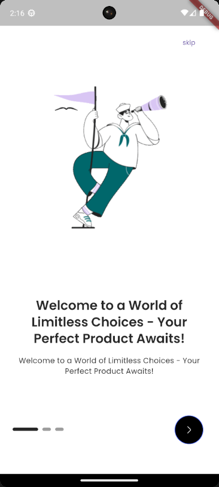

# E-Commerce Flutter App

A modern and feature-rich e-commerce mobile application built with Flutter, following clean architecture principles and utilizing Firebase services.

## Splash page


## Table of Contents
- [E-Commerce Flutter App](#e-commerce-flutter-app)
  - [Splash page](#splash-page)
  - [Table of Contents](#table-of-contents)
  - [Overview](#overview)
  - [Features](#features)
  - [Getting Started](#getting-started)
    - [Prerequisites](#prerequisites)
    - [Dependencies](#dependencies)
    - [Installation](#installation)
  - [Project Structure](#project-structure)
  - [Implementation Guide](#implementation-guide)
    - [Authentication Module (example)](#authentication-module-example)
    - [Product Catalog Module (example)](#product-catalog-module-example)
  - [Notes](#notes)
    - [GetX](#getx)
    - [Grid Layout](#grid-layout)
      - [shortcut command ---\> gridViewB](#shortcut-command-----gridviewb)
        - [It will generate below contents](#it-will-generate-below-contents)
          - [Complete syntax](#complete-syntax)

## Overview

This e-commerce application provides a seamless shopping experience with intuitive UI, smooth animations, and robust backend integration with Firebase services. The app follows the GetX pattern for state management and dependency injection.

## Features

- 🔐 User authentication and profile management
- 🏪 Interactive product catalog with categories and search
- 🛒 Shopping cart functionality (haven't yet)
- 💳 Secure payment processing
- 📦 Order tracking (haven't yet)
- 💖 Wishlist functionality
- 🌙 Dark/Light theme support
- 🌐 Multi-language support (haven't yet)
- 📱 Responsive design for various device sizes

## Getting Started

### Prerequisites

- Flutter SDK 3.19.0 or higher
- Dart 3.3.0 or higher
- Android Studio / VS Code
- Firebase account
- Git

### Dependencies

```yaml
dependencies:
  flutter:
    sdk: flutter

  # Utility Packages
  http: ^1.2.1
  intl: ^0.19.0
  logger: ^2.2.0
  url_launcher: ^6.2.6
  flutter_native_splash: ^2.4.0
  smooth_page_indicator: ^1.1.0
  connectivity_plus: ^6.0.3
  lottie: ^3.1.0

  # Icons
  iconsax: ^0.0.8
  cupertino_icons: ^1.0.6

  # State Management
  get: ^4.6.6
  get_storage: ^2.1.1

  # Product Specific
  readmore: ^3.0.0
  carousel_slider: ^5.0.0
  flutter_rating_bar: ^4.0.1
  capped_progress_indicator: ^0.0.2

  # Firebase
  firebase_core: ^2.30.1
  firebase_auth: ^4.19.4
  cloud_firestore: ^4.17.2
```

### Installation

1. Clone the repository:
```bash
git clone https://github.com/yourusername/ecommerce-flutter.git
cd ecommerce-flutter
```

2. Install dependencies:
```bash
flutter pub get
```

3. Configure Firebase:
```bash
flutter pub add firebase_core
flutterfire configure
```

4. Run the app:
```bash
flutter run
```

## Project Structure

```
lib/
├── common/
│   ├── styles/      
│   ├── widgets/      # reusable widgets
├── data/
│   ├── repositories/    
│   └── services/   # API services
├── features/
│   ├── authentication/    
│   ├── personalization/       # Auth related screens and logic
│   └── shop/        # Shop related screens and logic
├── localization/
├── utils/      
│   ├── constants/         # App-wide constant values and configurations
│   ├── device/            # Device-specific utilities and information
│   ├── exceptions/        # Custom exception handling
│   ├── formatters/        # Data formatting utilities
│   ├── helpers/           # General helper functions
│   ├── http/              # HTTP request handling utilities
│   ├── loaders/           # Asset and data loading utilities
│   ├── local_storage/     # Local data persistence utilities
│   ├── logging/           # Logging and debugging utilities
│   ├── popups/            # Popup dialogs and notifications
│   ├── theme/             # Theme-related utilities
│   └── validators/        # Input validation utilities
├── app.dart     # App-wide theme settings and configurations
├── main.dart              # Entry point
└── navigation.dart         # handle the app's navigation structure with a bottom bar
```

## Implementation Guide

### Authentication Module (example)

The authentication module handles user registration, login, and profile management using Firebase Authentication.

**Key Implementation Steps:**

1. Create Firebase Authentication services:

```dart
class AuthenticationService {
  final FirebaseAuth _auth = FirebaseAuth.instance;
  
  Future<UserModel?> signInWithEmailAndPassword(String email, String password) async {
    try {
      final userCredential = await _auth.signInWithEmailAndPassword(
        email: email,
        password: password,
      );
      return userCredential.user != null ? UserModel.fromFirebase(userCredential.user!) : null;
    } catch (e) {
      Logger().e('Sign in error: $e');
      return null;
    }
  }
  
  // Additional authentication methods...
}
```

2. Implement authentication controller with GetX:

```dart
class AuthController extends GetxController {
  final AuthenticationService _authService = Get.find<AuthenticationService>();
  final Rx<UserModel?> user = Rx<UserModel?>(null);
  
  @override
  void onInit() {
    super.onInit();
    FirebaseAuth.instance.authStateChanges().listen((firebaseUser) {
      if (firebaseUser != null) {
        user.value = UserModel.fromFirebase(firebaseUser);
      } else {
        user.value = null;
      }
    });
  }
  
  Future<bool> login(String email, String password) async {
    try {
      final user = await _authService.signInWithEmailAndPassword(email, password);
      return user != null;
    } catch (e) {
      Get.snackbar('Error', 'Login failed: $e');
      return false;
    }
  }
  
  // Additional authentication methods...
}
```

### Product Catalog Module (example)

The product catalog displays items from Firestore with filtering, sorting, and search capabilities.

**Key Implementation Steps:**

1. Create product model:

```dart
class Product {
  final String id;
  final String name;
  final String description;
  final double price;
  final List<String> images;
  final String category;
  final double rating;
  final int stock;
  
  Product({
    required this.id,
    required this.name,
    required this.description,
    required this.price,
    required this.images,
    required this.category,
    required this.rating,
    required this.stock,
  });
  
  factory Product.fromFirestore(DocumentSnapshot doc) {
    final data = doc.data() as Map<String, dynamic>;
    return Product(
      id: doc.id,
      name: data['name'] ?? '',
      description: data['description'] ?? '',
      price: (data['price'] ?? 0).toDouble(),
      images: List<String>.from(data['images'] ?? []),
      category: data['category'] ?? '',
      rating: (data['rating'] ?? 0).toDouble(),
      stock: data['stock'] ?? 0,
    );
  }
}
```

2. Implement product repository:

```dart
class ProductRepository {
  final FirebaseFirestore _firestore = FirebaseFirestore.instance;
  
  Future<List<Product>> getProducts({
    String? category,
    String? searchQuery,
    String? sortBy,
  }) async {
    Query query = _firestore.collection('products');
    
    if (category != null && category.isNotEmpty) {
      query = query.where('category', isEqualTo: category);
    }
    
    if (searchQuery != null && searchQuery.isNotEmpty) {
      // For proper search, consider using Algolia or other search services
      query = query.where('name', isGreaterThanOrEqualTo: searchQuery)
                  .where('name', isLessThanOrEqualTo: searchQuery + '\uf8ff');
    }
    
    if (sortBy != null) {
      switch (sortBy) {
        case 'price_asc':
          query = query.orderBy('price', descending: false);
          break;
        case 'price_desc':
          query = query.orderBy('price', descending: true);
          break;
        // Add other sorting options
      }
    }
    
    final snapshot = await query.get();
    return snapshot.docs.map((doc) => Product.fromFirestore(doc)).toList();
  }
  
  Future<Product?> getProductById(String id) async {
    final doc = await _firestore.collection('products').doc(id).get();
    return doc.exists ? Product.fromFirestore(doc) : null;
  }
}
```
</br>

## Notes

### GetX
<hr>

### Grid Layout
#### shortcut command ---> gridViewB
##### It will generate below contents


###### Complete syntax
```dart
//Main = vertical Cross = horizontal
GridView.builder(
        itemCount: 4, //how many items in total
        shrinkWrap: true, // only take as much as space as its items need
        physics: const NeverScrollableScrollPhysics(), // make it not scrollable
        padding: EdgeInsets.zero, 
        gridDelegate:
            const SliverGridDelegateWithFixedCrossAxisCount(
                crossAxisCount: 2, // how many items placed horizontally
                mainAxisSpacing: TSizes.gridViewSpacing,
                crossAxisSpacing: TSizes.gridViewSpacing,
                mainAxisExtent: 288,
            ),
        itemBuilder: (_, index) => TProductCardVertical()),
```


